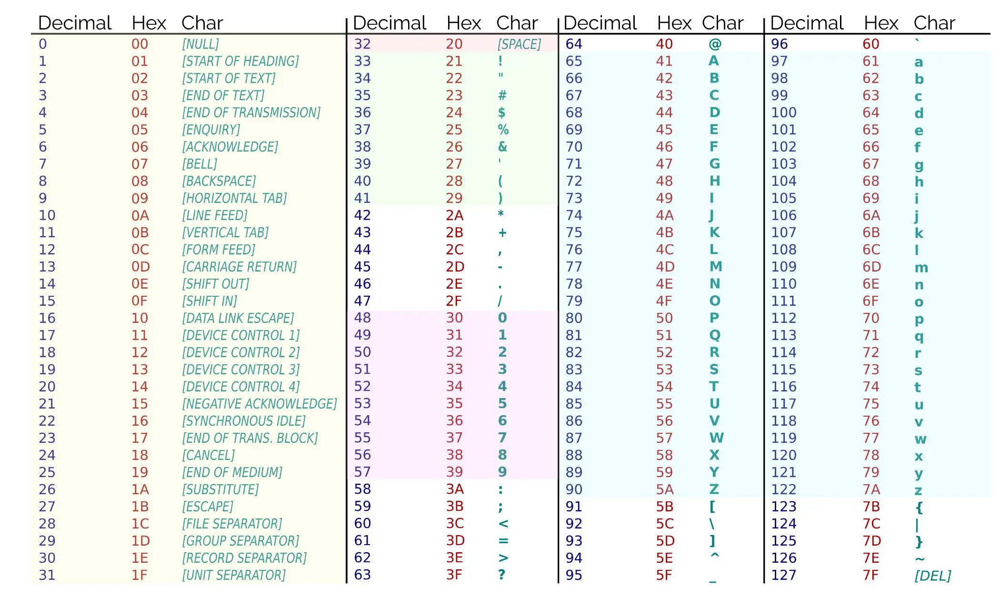
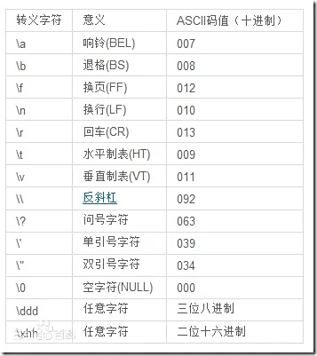

# Lesson1

```text
Lesson1: 不要对我抱有太多期待
```

## Chapter1 认识python

### python是什么

python是一种编程语言，你可以用它写自己的程序。

### python文件

python文件都以`.py`的文件后缀名结尾，但是这其实就是个标识，其本质只是一个文本文件，里面存储的只是字符，很多很多的字符而已。

### 使用python

你可以打开终端，输入`python`，然后一行行输入语句使用python。

或者使用

```shell
python file_name.py
```

的方式执行某一个python文件，我们更常使用后者。

### python解释器

刚刚说过了，python文件的本质只是一个`文本文件`，而我们知道，计算机实际上不认识什么是文本，它只认识010101这样的二进制01序列，所以要有个翻译，把你的文本文件，翻译成计算机认识的样子然后执行。

这个程序就是python`解释器`，没错，听起来很高大上，实际上也就是个翻译官。通过这个解释器，我们就能执行python
程序了。

---

## Chapter2 基础的变量和输入输出

### 什么是变量

变量是一个可以储存值的量，可以实现运算，特定的值的复用等等操作。

变量是我们编程的基础，在python中，任何一个变量都需要有以下两个要素:

- 类型
- 值

### 声明并定义一个变量

在声明时，我们必须给变量赋予初值，不能像下面这样定义变量

```python
a # Invalid
b # Invalid
```

应该像这样定义

```python
a = 114514  # Valid
b = 1919810 # Valid
```

### 变量标识符规则

什么是`变量标识符`？就是你的`a`,`b`这样的符号，也有人管这个叫做`变量名`。  
当然你可以把这个标识符写得复杂一点，像这样

```python
hello_it_is_the_python_teaching_document_written_by_Soren = 350234 # Valid
```

不过我们写标识符的时候还是要遵循以下规则：

1. 只能由小写字母，大写字母，数字，下划线组成
2. 不能由数字开头
3. 不能是python的关键字
4. 区分大小写

```python
# Valid identifiers
abc = 2
_car = 3
worker1 = 4
diligent_2 = 5
_ = 6

# Invalid identifiers
1_car = 7
34wer = 8
```

### 基础类型

python中有四种常用的基础类型，分别是`整型`，`浮点型`，`字符串`，`布尔型`。

```python
# Integer
a = 1
b = 2

# Float
c = 1.5
d = 2.0
scientific_number = 1e2 # 这是科学技术法标识的，e代表10的n次方，这个数是100.0
# 科学技术法表示的数都是浮点型

# String
e = "Hello World!"
f = "jessie"
Lancer = 'dead' # 单双引号都是表示字符串
multiple_line_string = """Hello
Yes
Wooooohooo!
"""  # 多行字符串

# Boolean
is_true = True # 布尔型表示真和假，用于逻辑判断
caught = False
```

### 字符串特别篇: ASCII编码

众所周知，我们的计算机不认识字符，它只认识01序列，所以实际上我们的字符在计算机中不能以它原本的样子存储，也就是计算机不会存储一个像`A`一样的符号，取而代之的是人为规定的一套编码系统，它将常见字符和数字一一对应，当你需要使用某一个字符，比如字符`A`的时候，对于计算机而言就是取用一个对应的数字，比如说65。  
然后再通过计算机和人的一些小约定（其实就是在某个特定位置塞一个数字，当作给计算机的类型提示），让它知道自己要输出字符，于是输出一个对计算机和人而言长得都很像`A`的符号，不过人会把它直接看作是字符`A`就是了。  
以下是常见字符对应的ASCII表，这个标准被现在几乎所有计算机遵守。



另外，你如果不想查询`ASCII Table`，也可以通过python自己的函数实现转换。

```python
ch = chr(65) # ASCII的数字转换成字符
num = ord('A') # ASCII的字符转换成数字
```

### 转义字符

你应该已经注意到了，上面有很多长得完全不像字符的字符，从0-20对应的那些字符看起来非常奇怪。  
问题随之而来，我怎么去表示它们呢，比如10号的换行符，这个还是很重要的对吧。  

答案是转义字符，它们是一类特殊的字符，python常用转义字符表如下：



### 类型转换

python中的类型转换一般是用`类型加圆括号`的形式表示，如果这个类型转换是可以成立的，那么就会正常转换。

```python
var_int = 1
print(str(var_int))

s = "123"
str_to_int = int(s)
print(str_to_int)

another_str = "Hello World!"
print(int(another_str)) # Invalid
```

### 查看你的类型

python标准库中有一个名为`type`的函数，它可以用来查看任何变量的类型信息，比如像这样。

```python
a = 1
print(type(a))
```

### 万能的print函数

在我们刚刚接触python的时候就用过`print`，当时我们就用这个打印了`Hello World!`语句，在`python`中，我们就可以用它来打印几乎一切我们想要观测的事物。  

先试试看执行下面这串语句

```python
a = 1
print(a)
print(a + 1)

s = "Hello World!"
print(s)
# ...
```

你应该会看到打印出三行数据

```shell
1
2
"Hello World!"
```

我们其实没有刻意地提示换行操作，`print`语句会自行换行，如果你不想换行，可以这样写。

```python
print("Oh yeah!", end=" ")
```

这样就不会默认换行了，而是会变成默认跟着一个空格符号，你可以理解成这个end会跟在打印的语句最后，并且默认是换行，如果我们修改了这个end的值，就改变了它的这个行为。

### 打印多个变量

很简单，用逗号把这几个变量隔开就行了，实际打印的时候会在这几个变量中间塞一个空格以示分隔。

试试看吧

```python
a = 1
b = 2
c = 3
print(a, b, c)
```

### 接受终端的输入

使用`input`函数可以接受外部的输入

```python
input_content = input()
print(input_content)
```

使用`input`接受的数据会是一个字符串，即使你可能想输入一个整数

```python
input_content = input()
print(type(input_content))
```

我们的方法是接收到输入数据后，进行一步类型转换，当然你得保证输入的确实是个整数。

```python
input_content = input()
input_content_converted_to_int = int(input_content)
print(type(input_content_converted_to_int))
```

这样输入有个问题是，其实用户并不知道自己要输入什么，当然你可以先print一句话提示，不过`input`函数已经想到这个问题并提供了一个方法。

```python
input_content = input("请输入你的身高: ")
print(input_content)
```

### 格式化的打印

格式化打印的意思就是按照某种格式打印，方法很多，只推荐两种

A. f-string

```python
a = 1
b = 2
print(f"{a} + {b} = {a+b}")
```

对于浮点数可以决定取几位小数或有效数字

```python
a = 1.2344123
b = a
print(f"{a:.2f} 保留了两位小数")
print(f"{a:.2g} 保留了两位有效数字")
```

B. format method

```python
format_string = "My name is {}, my age is {} years old"
print(format_string.format("Soren", 19))
```

### 注释

注释是专门给人看的东西，注释在运行的时候会被自动忽略不执行

```python
# 这是单行注释
"""
这是多行注释
对的，这是多行注释
"""
```

---

## Chapter3 python中的运算

### 字符串的拼接

拼接就是前后内容合并在一起，使用`+`运算符

```python
str1 = "Hello "
str2 = "World!"
str_final = str1 + str2
print(str_final)
```

### 重复字符串

比如你需要一个字符串叫`aaaaaaaa`，你当然可以打八个a，但是如果用拼接字符串的想法，我们可以用`*`运算符

```python
target = "a" * 8
```

### 四则运算和乘方

四则运算不必多说，python的运算相当符合直觉，该多少就是多少，不过就像很多计算器一样，python算出来的数据未必是精确解（例如`1/7`），而可能是近似解（例如`0.14285714285714285`）

```python
a = 1
b = 2
print(f"a + b = {a + b}")
print(f"a - b = {a - b}")
print(f"a * b = {a * b}")
print(f"a / b = {a / b}")
```

乘方就是指数运算，最常用的乘方自然是平方和立方，使用`**`运算符

```python
a = 3
b = 2
print(f"a ** b = {a ** b}")
```

### 不同类型之间的运算

刚刚实际上已经说了一些，比如字符串和整型的混合运算，当布尔型参与数的计算的时候，它们会被转成整型（True对应1， False对应0）参与计算。

```python
print(True + 1.0)
```

而其他很多运算，尤其是字符串和数之间有比较严格的类型检查，不允许你随便混合字符串和其他类型的运算，比如试试下面这段

```python
print(8 * "a")
print(8 + "a")
```

有些运算看起来很奇怪，其行为也很不好预测，希望各位不要写这种看起来很奇怪的运算

```python
print(True and "a") # It can run.
```

### 开根号和使用数学常数

在使用这些操作之前，我们要导入一些库，由于python自己不自带直接开根号的功能，我们需要导入`math`库

```python
import math
```

然后就可以愉快地数学了

```python
import math
print(math.e)
print(math.pi)
print(math.sqrt(4))
print(math.sqrt(-1))
```

### 比较运算

比较顾名思义就是比大小，对于整数和浮点数这很自然，数字大不大是很自然和一目了然的

```python
print(1 > 2)
print(114514 < 191981.0)
print(2 == 2.0)
print(2 != 3)
```

你会发现比较之后你获得了一个布尔值，也就是比较逻辑是对的还是错的，这很自然对吧。

但是字符串呢？答案是通过逐个字符比较它们的ASCII码来判断，

```python
print("ABC" < "BCD")
print("ABC" == "ABD")
print("ABC" < "ABCD")
```

布尔型简单粗暴，True是1, False是0，然后代入整型的比较逻辑

```python
print(True > False)
```

### 逻辑运算

只要掌握三种，`and`, `or`, `not`，分别对应与，或，非

- and:
  
| A | B | A and B |
|:---|:---|:---|
|False | False | False |
|True | False | False |
|False | True | False |
|True | True | True |

- or:

| A | B | A or B |
|:---|:---|:---|
|False | False | False |
|True | False | True |
|False | True | True |
|True | True | True |

- not:

| A | not A|
|:---|:---|
| True | False |
| False | True|

```python
print(True and True)
print(True and False)
print(True or False)
print(False or False)
print(not True)
```

### 运算符优先级

python没有所谓的运算优先级，但是运算对应的运算符是有优先级的，大致如下，只需关心自己认识的即可：

1. 圆括号 ()：用于改变运算顺序。
2. 指数 **：右结合（从右到左计算）。
3. 正负号 +x, -x：一元加和减。
4. 位运算 NOT ~x：按位取反。
5. 乘、除、取模和整除 *, /, %, //：左结合。
6. 加法和减法 +, -：二元加和减，左结合。
7. 位移运算 <<, >>：左结合。
8. 位运算 AND &。
9. 位运算 XOR ^。
10. 位运算 OR |。
11. 比较运算符 <, <=, >, >=, ==, !=。
12. 等同运算符 is, is not。
13. 成员资格运算符 in, not in。
14. 逻辑运算 NOT not：逻辑非，右结合。
15. 逻辑运算 AND and：逻辑与，左结合。
16. 逻辑运算 OR or：逻辑或，左结合。
17. 条件表达式 A if condition else B：三元运算符，右结合。
18. 赋值运算符 =, +=, -=, \*=, /=, %=, //=, \*\*=, &=, |=, ^=, >>=, <<=：右结合。

### 练习1

以下练习中需要输出数据的场合均输出2位小数。

1. 提问用户年龄是多少，并输出它明年多大
2. 写一个程序，接收二元一次方程的`a`，`b`，`c`参数，并输出两个解（默认两实数根）
3. 写一个程序，接受一个人的身高和体重数据，输出他的BMI
4. 写一个程序，接受两个参数，判断他们对7是否余数相同
5. 写一个程序，接受两个电阻值，计算它们并联后的总电阻
6. 写一个程序，接受4个参数，并依次输出，要求每两次输出中间间隔一个" and "字符串
7. 打印一个马里奥:

```text
                ********
               ************
               ####....#.
             #..###.....##....
             ###.......######              ###            ###
                ...........               #...#          #...#
               ##*#######                 #.#.#          #.#.#
            ####*******######             #.#.#          #.#.#
           ...#***.****.*###....          #...#          #...#
           ....**********##.....           ###            ###
           ....****    *****....
             ####        ####
           ######        ######
##############################################################
#...#......#.##...#......#.##...#......#.##------------------#
###########################################------------------#
#..#....#....##..#....#....##..#....#....#####################
##########################################    #----------#
#.....#......##.....#......##.....#......#    #----------#
##########################################    #----------#
#.#..#....#..##.#..#....#..##.#..#....#..#    #----------#
##########################################    ############

```

---

## Chapter4 分支判断和循环

### 回顾布尔值

布尔值是表示真假的值，它有独特的几个运算，也就是与或非，`and`, `or`, `not`

### if-else分支

`if`是条件判断中最重要的一环，它用于条件判断，它判断的条件为True时，执行if分支，否则跳过不执行

```python
# 格式如下：
if condition:
    statement
```

写一个简单的if语句感受一下吧

```python
a = input("print a number: ")
a = int(a)
if a == 1:
    print("Yes") # indent block
```

当然实际上我们不可能光想要这样的效果，我们使用分支常常是为了达成`如果A，就。。。，否则，。。。`的效果，那么我们就需要另一个关键字`else`，它的作用就是`否则`

```python
a = input("Print a number: ")
a = int(a)
if a == 1:
    print("Yes")
else:
    print("No")
```

那么假如说我们选项有三个怎么办，那当然可以只用if-else完成

```python
a = input("Print a number: ")
a = int(a)
if a == 1:
    print("Yes")
else:
    if a == -1:
        print("Not bad")
    else:
        print("No")
```

但是看起来就很臃肿，我们简化一下它：用`elif`关键字，它是`else if`的简写

```python
a = input("Print a number: ")
a = int(a)
if a == 1:
    print("Yes")
elif a == -1:
    print("Not bad")
else:
    print("No")
```

这样看起来就好很多了，清晰明了，当然你可以用很多`elif`

```python
a = input("Print a number: ")
a = int(a)
if a == 1:
    print("Yes")
elif a == -1:
    print("Not bad")
elif a == 0:
    print("Not good")
else:
    print("No")
```

但是一个else必须找到一个if，否则语法不正确

### for循环

循环是个非常重要的概念，我们经常有需要重复执行多少次的请求，比如我需要重试3次，这3次需要执行的内容是一模一样的，如果写三遍那也太麻烦了，所以我们有了循环。

```python
a = 1
for i in range(10):
    print(a)
    a += 1
```

就像这样，我们就定义了一个for循环，这个结构可以让我们循环10次，如果要循环20次，只要把10改成20即可

#### Special: range function

range是个函数，它有三种形式

```python
range(stop)                  # 从 0 开始，到 stop-1 结束，步长为 1
range(start, stop)           # 从 start 开始，到 stop-1 结束，步长为 1
range(start, stop, step)     # 从 start 开始，到 stop-1 结束，步长为 step（step≠0）
```

可以根据需求使用

### while循环

for循环经常是在我们已知循环次数的时候用的，但是如果我不需要等三次密码输入错误，而是我要让它重试到输入正确呢？  
用while循环，while循环会一直执行，直到达到退出条件。

```python
a = 1
while a < 10:
    print(a)
    a += 1
```

它会一直执行，直到`a < 10`这个条件不再成立

### 循环控制

循环可能会有提前退出的情况，还是输入密码的例子，我一旦输入正确就要提前退出了，怎么办呢？答案是`break`和`continue`关键字，

- `break`： 提前退出循环
- `continue`： 无视剩下的代码，直接跳到下一次循环

```python
a = 1
while a < 10:
    if a < 0:
        print("a is too small!")
        break
    if a % 3 == 0:
        a += 2
        continue
    print(a)
    a += 1
```

### 练习2

1. 猜数字游戏，使用随机数生成一个数，然后让玩家不断猜测，并提示所猜数字大或小，直至猜对
2. 打印[m, n]范围内的所有偶数（m，n是自己指定的）
3. 优化之前解一元二次方程的代码，在方程无实数解的时候提示"无实数解"，有两个相同解时提示"有两个相同的解"
4. 打印斐波那契数列的前20项
5. 打印九九乘法表
6. 自己设定一个密码，让用户输入密码，如果3次输入错误就终止程序并提示，输入正确就提示登陆成功
7. 打印一个菱形

```text
   *
  ***
 *****
*******
 *****
  ***
   *
```

---

## Chapter5 容器类型

### 列表

我们刚才写的代码的变量个数都很少，只有3-5个，故而没有存储大量数据的要求，但是实际上代码写起来经常有同时存储很多数据的需求，比如你需要存储100个学生的生日信息，然后对它们排个序，难道你真的希望定义100个变量吗？  
所以，让我们学习一下`列表`，这是一种可以存储很多数据的容器，我们可以用如下方法定义一个列表

```python
a = [1, 2, 3, 4]
print(a)
```

列表的存储空间理论上是几乎没有上限的。  
列表还有其他生成方式，这本质上其实是一个构造函数，后面在`Chapter 8`我们会介绍，现在你只需要会使用就可以了

```python
l1 = list(range(10))
l2 = list("Hello")
```

- Special: 字符串split

字符串可以通过这个方法拆分，比如说这样

```python
a = "Python teaching"
l = a.split()
```

如果这样调用，就会默认把空格符号作为分隔符，然后把空格符前后的内容分别提取出来，放入一个列表里面。  
也可以自己定义依靠什么分隔

```python
a = "Python\nteaching"
l = a.split('\n')
```

#### 列表的增删改查

```python
languages = ['Python', 'C++', 'Java']
languages.append('Golang')
languages.insert(1, 'JavaScript')

if 'Java' in languages:
    languages.remove('Java')
temp = languages.pop(1)
print(temp)
languages.pop()
print(languages)

print(len(languages))
languages.clear()
print(languages)

languages = ['C', 'Objective C', 'HTML', 'CSS']
print('C' in languages)

```

### 索引

依然是标号的思想，我们有时候

### 用循环遍历容器

### 切片

### 元组

### 集合

### 字典

### 列表生成式

### 练习3

1. 投6000次骰子，分别输出6个点数的出现次数
2. 生成1000个标准正态分布的数据，然后输出前五个和后五个数据，然后验证它的平均值和方差是否符合预期
3. 对字符串的所有小写字母改成大写
4. 生成含从1到20所有整数的平方的列表，即\[1, 4, 9, ...\]
5. 反转一个列表
6. 给定一个段落，统计每个单词的出现次数并输出
7. 给定一组数据，进行去重操作并输出

---

## Chapter6 函数

### 特殊的类型: None

### 定义一个函数

### 让函数返回值

### 让函数提前返回

### 更严格的类型检查

### 在函数中修改变量的值

### 位置参数和关键字参数

### 练习4

## Chapter7 更进一步的函数和模块

### 函数默认值

### 函数作用域

### 回调函数

### 可变参数

### lambda表达式

### map, reduce, filter, sorted

### 模块

### 练习5

## Chapter8 面向对象

### 什么是面向对象

### 类

### 继承和多态

### 定义权限

### 静态方法

### 属性

### 魔法方法

### 练习6

## Special 从底层看待python

### python的对象真的是对象吗？

### python的id函数和is方法

### 容器的本质 - 数据结构

### 元对象系统

### 批量处理VS循环单体处理

## Chapter9 文件IO

### 文件的读写

### json文件读写

### 异常处理

### 练习7

## Chapter10 再进一步的函数

### 闭包

### 生成器和迭代器

### 上下文管理器

### 函数装饰器

### 返回可迭代对象

## Chapter11 模块和包

### os

### sys

### 定义你的模块

### 定义你的包

## Chapter12 管理你的项目

### git

### markdown

### github
