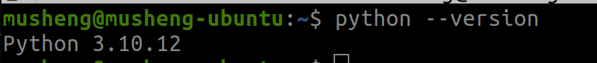

# Python 安装教程

声明：如只是参加讲座，可以只完成`环境安装`和`安装开发工具`中的`VSCode`部分。

## 环境安装

工欲善其事，必先利其器，先把最基础的python解释器下载下来吧。

### Windows

通过python官网下载，具体可参照[安装教程](https://blog.csdn.net/maiya_yayaya/article/details/131450517)  ，记得勾选`添加到PATH`一项
可以和本教程一致，安装`Python 3.9.24`，或者其他版本

> modify it to my own installation tutorial

### Linux

以`Ubuntu`系统举例，我相信用其他Linux版本的朋友肯定有自己安装python的能力

```shell
sudo apt install python3
sudo apt install python-is-python3
```

### Mac

麻烦参考[Mac安装Python官方教程](https://docs.python.org/zh-cn/3/using/mac.html)，本人没有Mac系统，无法演示

### 验证安装成功

打开`终端`或`cmd`，输入

```shell
python --version
# 或者输入
python3 --version 
```

弹出来的是版本号就对了，就像这样



## 本教程环境

本教程使用`Ubuntu 22.04 LTS`系统，python版本为`Python 3.9.24`，使用`anaconda`创建的虚拟环境。  

> 关于本教程使用的不是`Windows`或`Mac`系统这点不必太慌张，`python`支持跨平台，同样的源码只要环境是一样的，就可以在这几个系统中运行出一样的结果。

## 虚拟环境

> 该部分可以选择是否需要安装，本讲座不会涉及，但是未来使用Python的时候，这部分是不可避免的

请查看[Anaconda虚拟环境安装教程](CondaInstall.md)


## 安装开发工具

一般我们不用`python`自带的`IDLE`，而是用更好的开发工具，这里推荐`VS Code`和`PyCharm`

### VSCode

> 本讲座开始前请至少下载好VSCode和相关插件，本讲座会使用VSCode进行编程示例

登录[VSCode官网](https://code.visualstudio.com/download)，下载安装包安装VSCode。  

进入VSCode后，我们还要安装一些插件来优化我们的编程体验。 

首先安装简体中文语言包，点开左边有点像四个方块的图案，然后搜索`chinese`


再输入python，下载以下插件


然后就可以在VSCode里面愉快写Python了！

> 有些插件安装后，需要重启VSCode才会生效，卸载同理。

### Pycharm

> 可选，IDE的好处是操作方便和功能健全，但是也会影响初期对编程的理解，慎用

`Pycharm`是Jetbrains公司研发的针对python的IDE(Integrated Development Environment)，好用但是要花钱。  

但是学生可以免费享用完整版。  

前往[Pycharm下载官网](https://www.jetbrains.com/pycharm/download/)下载对应安装包下载即可，同时我们去[Jetbrains用户界面](https://account.jetbrains.com/licenses/assets)，使用学生邮箱注册账户，申请Pycharm的完整版许可证。

## 结语

以上教程走完你应该有一个基础的开发工具了，打开你的`终端`或`cmd`，输入以下内容，开始你的编程之旅吧

```shell
python
print("Hello World")
quit()
```
