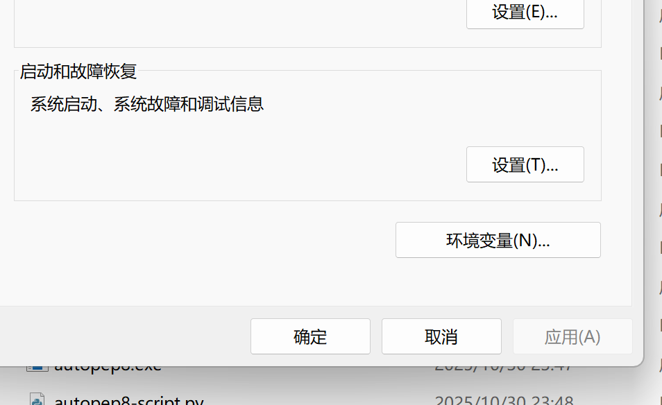

# Anaconda 安装教程

By Soren (aka musheng-bot)

## 找到官网

请搜索[Anaconda](https://www.anaconda.com/)进入官网

## 注册帐号

请点击`登录`或`Sign in`条目并注册新账号，注册账号需要绑定一个邮箱。

注册完毕后登录，应该进入了如下界面

## 下载

点击左侧的`Getting Started`或`开始`，并在之后的页面找到`Downloads`或`下载`选项，会跳转到这一个界面。

随后我们点击`Ger started`或`开始`按钮，跳转到一个选择安装界面

这里有两个选择，两个的主要区别是

- `Distribution`内容更全，体积较大
- `Miniconda`体积比较小，只保留部分内容

如果不知道装哪个可以选`Miniconda`版本，点击下载，根据自己的系统类型选择，大部分同学应该都是`Windows x86_64`(或者说`Windows 64位系统`)系统，安装前请在系统设置里确认。

---

等待下载完毕后，打开安装程序，途中有两个选项需要注意

这里建议勾选第一个，不建议勾选第二个，其他根据自己需求安装即可

## 环境变量设置

一般勾选上一个选项后，就会把`环境变量`编辑完毕，但是以防万一，我们还是讲解一下设置环境变量。

首先，找到`anaconda`的安装路径，然后进入其下的`Scripts`文件夹，复制这个路径。

然后点开环境变量配置页面，在搜索框内搜索`环境`一般就会弹出。

接着点击`环境变量`

然后找到`PATH`一项，点击`PATH条目`，再点击`编辑`

然后点击右边`新建`，把刚才的路径粘贴进去

接着一直点确定！一定要所有的界面都点一次确定，直到退回桌面。

## 验证安装成功

打开`命令行终端`或者`cmd`，输入以下指令，弹出版本号则安装完毕。

---

接下来是有关于`虚拟环境`概念的介绍

## 虚拟环境

虚拟环境是一个用户自己定制的特殊编程环境，和正常使用python的方式一致，但是各个虚拟环境是独立的，和系统默认的环境也是独立的。

虚拟环境的重要性在于，很多python项目的环境差别很大，python版本，安装的包的种类，版本等等都可能不同。  
如果没有虚拟环境，那么所有python项目都要共享同一个环境，这会导致我们在研究不同项目时都要对原有环境做一定适配，包括但不限于

- python版本升级/降级
- 包重新安装
- 包版本升级/降级

非常麻烦，因此我们才引入了`虚拟环境`的概念。  
如果你当前不在虚拟环境中，那么你使用的就是系统默认的环境。

### 使用虚拟环境

#### anaconda

`anaconda`是一个包管理器，在其中你可以自己创建环境，让多个项目使用同一个环境，甚至可以修改`python版本`。

我们大概罗列一下conda的指令，如果感觉指令太多，可以先掌握

- `conda activate`
- `conda deactivate`
- `conda install`
- `conda list`

这四条指令和相关内容，其他的可以深入学习过后再阅读和了解。

我们后续的conda相关操作也会带着大家一起做的，可以在实际使用的过程中了解和学习。

| 功能分类      | 指令示例                                       | 说明                                                                     |
|-----------|--------------------------------------------|------------------------------------------------------------------------|
| **版本与帮助** | `conda --version`                          | 查看 Conda 版本                                                            |
|           | `conda -h` 或 `conda --help`                | 查看 Conda 帮助文档                                                          |
|           | `conda <命令> -h` （如 `conda create -h`）      | 查看具体命令的帮助（如创建环境的参数说明）                                                  |
| **环境管理**  | `conda env list` 或 `conda info --envs`     | 列出所有虚拟环境（`*` 表示当前激活环境）                                                 |
|           | `conda create -n <环境名>`                    | 创建新环境（默认继承 base 环境的 Python 版本）                                         |
|           | `conda create -n <环境名> python=3.9`         | 创建指定 Python 版本的环境（如 Python 3.9）                                        |
|           | `conda activate <环境名>`                     | 激活虚拟环境（Windows 用 cmd/PowerShell，Linux/macOS 通用）                        |
|           | `conda deactivate`                         | 退出当前虚拟环境                                                               |
|           | `conda remove -n <环境名> --all`              | 删除指定虚拟环境（需先退出该环境）                                                      |
|           | `conda rename -n <旧名> -n <新名>`             | 重命名虚拟环境（Conda 4.14+ 支持）                                                |
| **包管理**   | `conda list`                               | 列出当前环境已安装的包                                                            |
|           | `conda list -n <环境名>`                      | 列出指定环境的已安装包                                                            |
|           | `conda install <包名>`                       | 在当前环境安装指定包（如 `conda install numpy`）                                    |
|           | `conda install <包名>=1.2.3`                 | 安装指定版本的包（如 `conda install pandas=1.5.3`）                               |
|           | `conda install -n <环境名> <包名>`              | 给指定环境安装包（无需激活该环境）                                                      |
|           | `conda update <包名>`                        | 更新当前环境的指定包                                                             |
|           | `conda update --all`                       | 更新当前环境的所有包                                                             |
|           | `conda remove <包名>`                        | 卸载当前环境的指定包                                                             |
|           | `conda search <包名>`                        | 搜索 Conda 仓库中可用的包版本                                                     |
| **镜像配置**  | `conda config --show channels`             | 查看当前配置的镜像源                                                             |
|           | `conda config --add channels <镜像地址>`       | 添加镜像源（如清华源：`https://mirrors.tuna.tsinghua.edu.cn/anaconda/pkgs/main/`） |
|           | `conda config --remove channels <镜像地址>`    | 删除指定镜像源                                                                |
|           | `conda config --set show_channel_urls yes` | 显示包的安装来源（方便确认是否用了镜像）                                                   |
| **其他常用**  | `conda clean -p`                           | 清理未使用的包缓存（节省磁盘空间）                                                      |
|           | `conda clean -y --all`                     | 彻底清理所有缓存（包括索引和未使用包）                                                    |
|           | `conda env export > environment.yml`       | 导出当前环境的依赖清单到文件                                                         |
|           | `conda env create -f environment.yml`      | 根据依赖清单创建新环境                                                            |

#### virtualenv

这是`python`自带的一个虚拟环境工具，我们这里仅仅提及，想深入的朋友可以自行了解。

