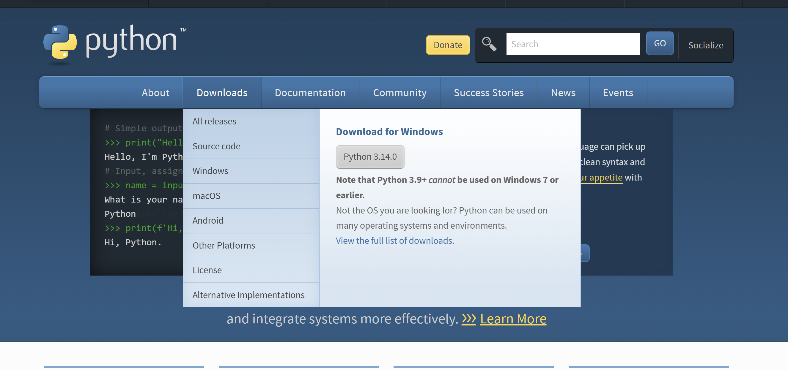
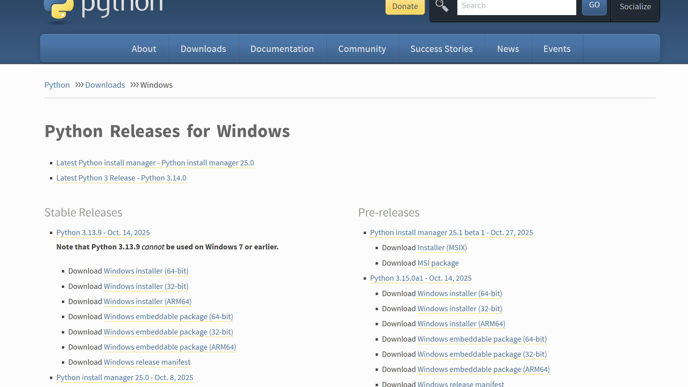
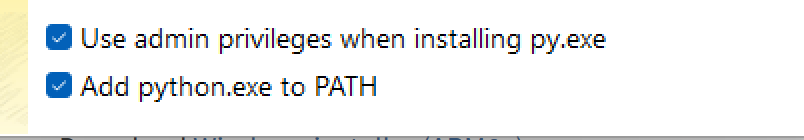
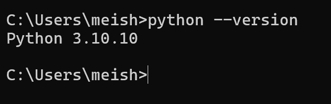
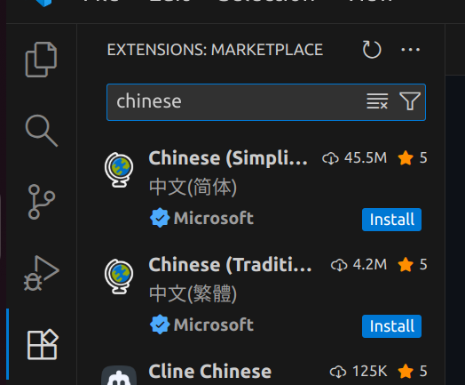
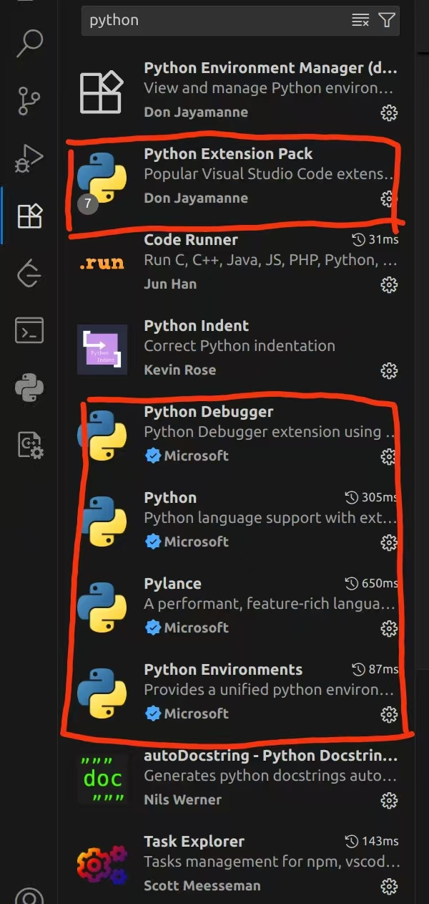

# Python 安装教程

声明：如只是参加讲座，可以只完成`环境安装`和`安装开发工具`中的`VSCode`部分。

## 环境安装

工欲善其事，必先利其器，先把最基础的python解释器下载下来吧。

由于大部分同学使用的是`Windows 64位系统`，我们就以这个为例来详细演示如何下载python。

### Windows 64位系统

1. 找到[python官网](https://www.python.org/)


2. 点开`Downloads`下的`All releases`





3. 往下翻到`python 3.10`版本，本次讲座我们会使用这个版本


4. 本机是`Windows 64位系统`，所以点击安装`Windows Installer 64-bit`一项

5. 稍等一下，等它下载完毕，然后点开这个安装程序


6. 请注意，务必勾选这个`Add to path`的选项



7. 等待安装完毕


8. 打开你的cmd


9. 输入以下命令`python --version`，如果成功弹出版本号就是安装成功！



如果没有成功输出，可能是电脑需要重启

### Mac

麻烦参考[Mac安装Python官方教程](https://docs.python.org/zh-cn/3/using/mac.html)，本人没有Mac系统，无法演示

## 虚拟环境

> 该部分可以选择是否需要安装，本讲座不会涉及，但是未来使用Python的时候，这部分是不可避免的

请查看**Anaconda虚拟环境安装教程**，已附在旁边

## 安装开发工具

一般我们不用`python`自带的`IDLE`，而是用更好的开发工具，这里推荐`VS Code`和`PyCharm`

### VSCode

> 本讲座开始前请至少下载好VSCode和相关插件，本讲座会使用VSCode进行编程示例

登录[VSCode官网](https://code.visualstudio.com/download)，下载安装包安装VSCode。  

进入VSCode后，我们还要安装一些插件来优化我们的编程体验。 

首先安装简体中文语言包，点开左边有点像四个方块的图案，然后搜索`chinese`



再输入python，下载以下插件



然后就可以在VSCode里面愉快写Python了！

> 有些插件安装后，需要重启VSCode才会生效，卸载同理。

### Pycharm

> 可选，IDE的好处是操作方便和功能健全，但是也会影响学习初期对编程的理解，编程初期慎用

`Pycharm`是Jetbrains公司研发的针对python的IDE(Integrated Development Environment)，好用但是要花钱。  

但是学生可以免费享用完整版。  

前往[Pycharm下载官网](https://www.jetbrains.com/pycharm/download/)下载对应安装包下载即可，同时我们去[Jetbrains用户界面](https://account.jetbrains.com/licenses/assets)，使用学生邮箱注册账户，申请Pycharm的完整版许可证。

## 结语

以上教程走完你应该有一个基础的开发工具了，打开你的`cmd`，输入以下内容，开始你的编程之旅吧

```shell
python
print("Hello World")
quit()
```
